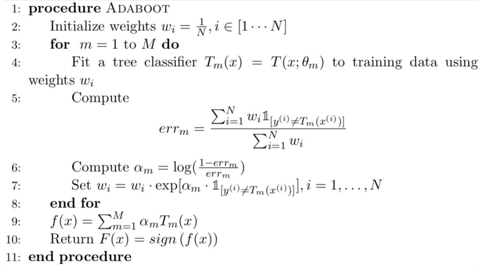
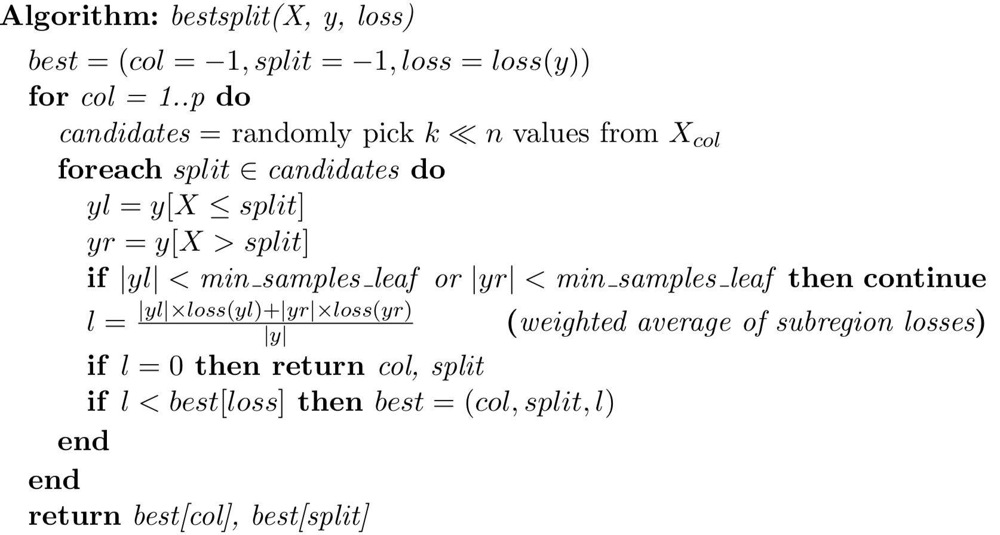

## ML-models-scratch-implementation

Here we implemented popular machine learning algorithm from scratch. We tried to add functionality similar to sklearn. Following are the algorithm we implemented:

### Adaboost

AdaBoost is an ensemble learning method (also known as “meta-learning”) which was initially created to increase the efficiency of binary classifiers. It is an iterative approach to learn from the mistakes of weak classifiers, and turn into strong ones.

#### Psuedocode

 

### Decision Tree

The aim of the decision tree is predict the target variable by learning simple decision rules inferred from the data features. It is quite interpretable while explaining the prediction. I tried to create decision tree mimicking the sklearn module for both Classification and Regression.

Below is the algorithm I used to find the best split to create a decision stump

 

### Random Forest

The decision tree model have a very high variance and can easily overfit the data thus do not generalize well on unseen data. To increase generality, random forests use a collection of decision trees that have been weakened to make them more independent. We trade a bit of accuracy for increase in generality. 

Splitting of individual tree would be same as the decision tree. However to reduce the bias we randomly select a set of feature to decide each decision stump.

    

Few properties includes:
1. Uses fully grown decision trees (low bias, high variance).
2. As the number of trees increases, the variance decreases
3. The trees are made uncorrelated to maximize the decrease in variance
4. Algorithm cannot reduce bias so that the bias is initially as low as possible

### Gradient Boosting

Gradient Boosting is a generalization of Adaboost. It fits additive model using stagewise additive modelling. We iterative try to learn the error at each step.
We used the following pseudocode to build gradient boosting for Squared-error loss
<
img src="images/bgbm_psuedocode.png" width="400" height="200" /> 

Few properties includes:
1. Uses weak learners (shallow decision trees)
2. Shallow decision trees have low variance but high bias
3. Gradient boosting tackles the error reduction task by reducing bias as the number of trees increases
4. Decrease variance by averaging

Additional Implementations:
1. Naive Bayes
2. Linear Regression with L2 Regularization 